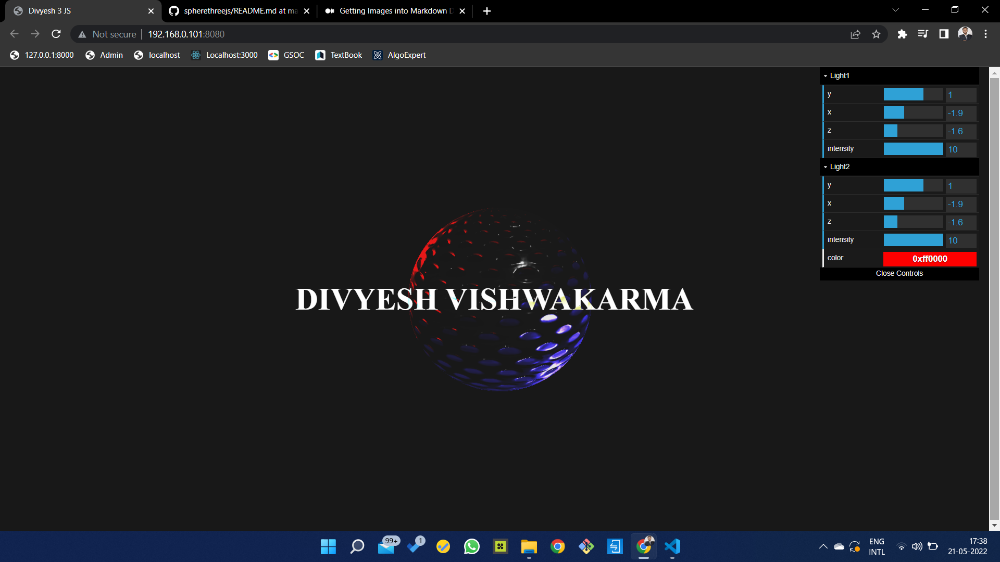

# Spherethreejs
Three JS try by Divyesh Vishwakarma deployed to _____________

## Description
I tried learning Webgl and Threejs and created this Sphere.

One can setup light color, light position and everything in this website. 
Have fun in 3D. 

In remembrance of Moti❤️

## Some Screenshots

### Main Page



#### Three.js Starter
Courtesy of Bruno Simon of https://threejs-journey.xyz/

##### Setup
Download [Node.js](https://nodejs.org/en/download/).
Run this followed commands:

``` bash
# Install dependencies (only the first time)
npm install

# Run the local server at localhost:8080
npm run dev

# Build for production in the dist/ directory
npm run build
```
